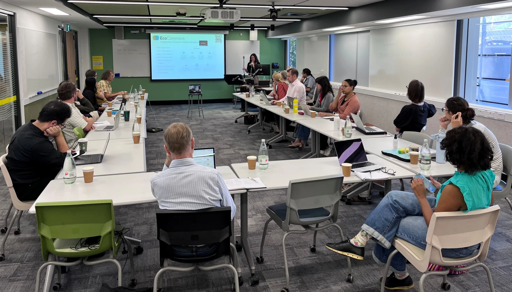

On February 16th the Centre for Ecosystem Science and the Australian Research Data Commons (ARDC) hosted the kick-off meeting for the Ecosystems Indicators Workflows project.

Project partners from UNSW (Restech, Data Science Hub, and Computer Science and Engineering), ARDC, the University of Melbourne, James Cook University (JCU), Queensland University of Technology (QUT), Queensland Cyber Infrastructure Foundation (QCIF), participated in the hybrid meeting, and were joined by guests from Atlas of Living Australia (ALA), and the Department of Climate Change, Energy, the Environment and Water of Australia.

The project aims at developing research infrastructure for transparent and reproducible workflow for fit-for-purpose, ecosystem-specific indicators. The project will also empower a community of practice for indicator design, and engage with end users in government and industry. This will support a wide range of projects in the partner institutions, from assessing risk of ecosystem collapse, to designing indicators for natural capital accounting and measuring ecosystem recovery. 

The project, its expectations and goals were introduced by Dr. José Ferrer-Paris and the project team roles and responsibilities by Dr. Paula Martinez from ARDC. Dr. Jenna Wraith from QCIF presented how QCIF EcoCommons can provide a user-friendly and tested platform for the project as well as amazing expertise from their team. In the last part of the meeting, participants discussed ways to have a smooth and effective partnership through common communication channels and clear governance structure.

The meeting showed a strong support for a new, innovative project with a clear and collaborative vision. Stay tuned for more updates!

## Content and links

- Presentation [code](https://github.com/Ecosystem-Indicators-Workflows/project-presentations) and [slides](https://jrfep.quarto.pub/ecosystems-indicators-workflows-project)
