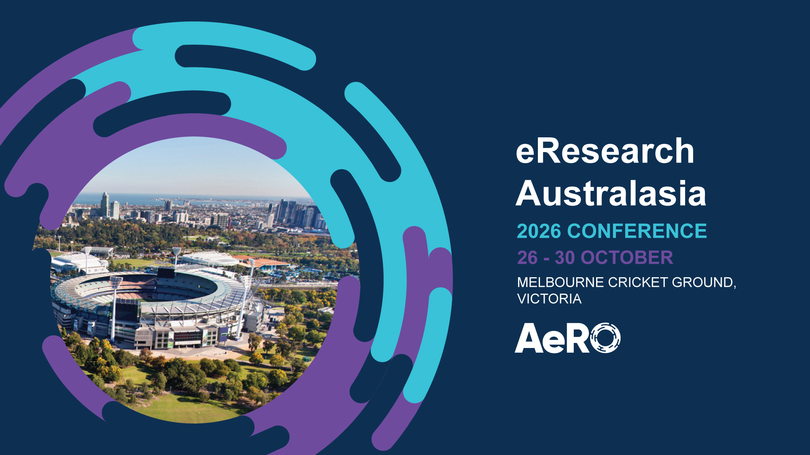

## Abstract
Many collaborative research projects face a common challenge: how to build and sustain user communities beyond project funding while balancing diverse stakeholder needs and feedback. This session explores practical approaches to evaluating and strengthening user community capacity across research infrastructure, digital research tools, and scientific software projects. 

It brings together community managers, product owners, project managers, research software engineers, research technologists, and researchers working with scientific tools, workflows, and engagement strategies. The focus is on framing community engagement as a series of targeted interventions aligned to user needs and project maturity, rather than a one-size-fits-all or static activity.

Facilitated by community leads Liz Stokes (Australian Research Data Commons) and Beatta Zarrabi (UNSW), the session opens with a short introduction to a community engagement framework. Participants will then engage in structured breakout discussions exploring shared challenges such as understanding user needs, embedding engagement into product development, and evaluating community value. To support equitable participation, breakout groups will assign defined roles (facilitator, note-taker, reporter, and devil’s advocate), ensuring balanced contribution and inclusive dialogue across participants. A plenary report-back will synthesise key insights and themes across groups. 

The BoF format enables open exchange, peer learning, and cross-institutional discussion. Attendees will gain practical strategies for embedding user engagement into project workflows, approaches for evaluating community impact, and connections with peers addressing similar challenges. Outcomes include a documented summary of discussion points, contributed insights to a community engagement framework, and identification of opportunities for ongoing collaboration and community-building activities. 

## Presenters Bios: 

Liz Stokes (Australian Research Data Commons) 
Liz Stokes is Skills Development Lead Trainer at the Australian Research Data Commons (ARDC), where she focuses on translating community and workforce development strategies into practical training and engagement programs. Her work centres on building capability across research software and data ecosystems, with an emphasis on embedding user needs into sustainable community practice. 

Beatta Zarrabi (UNSW) 
Beatta Zarrabi is a research and community engagement practitioner at UNSW with experience in developing and supporting collaborative research communities across interdisciplinary projects. Her work focuses on aligning user needs, stakeholder engagement, and project delivery to strengthen adoption and long-term impact of research tools and workflows. 

 
